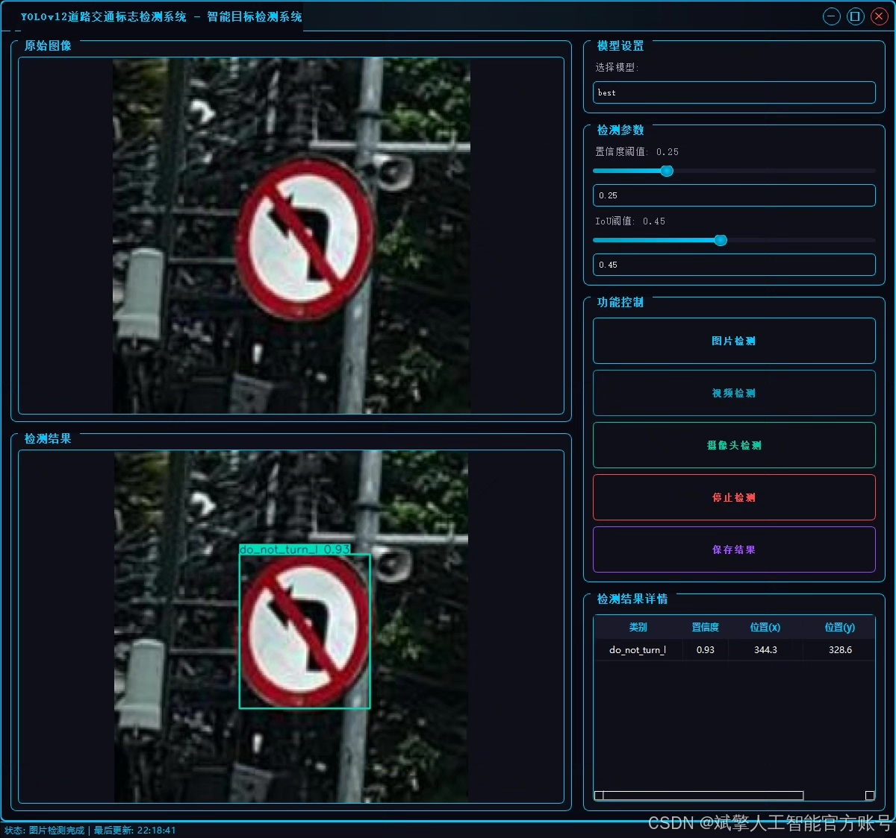
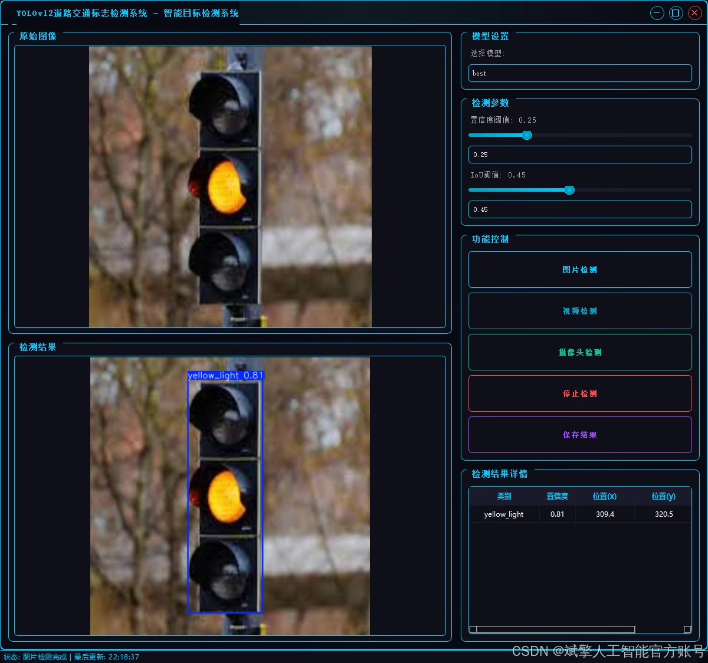
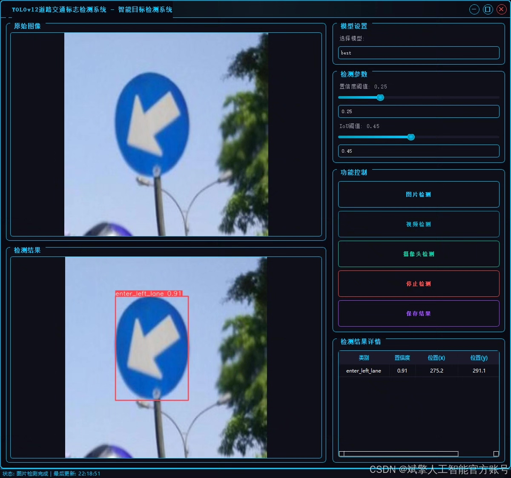
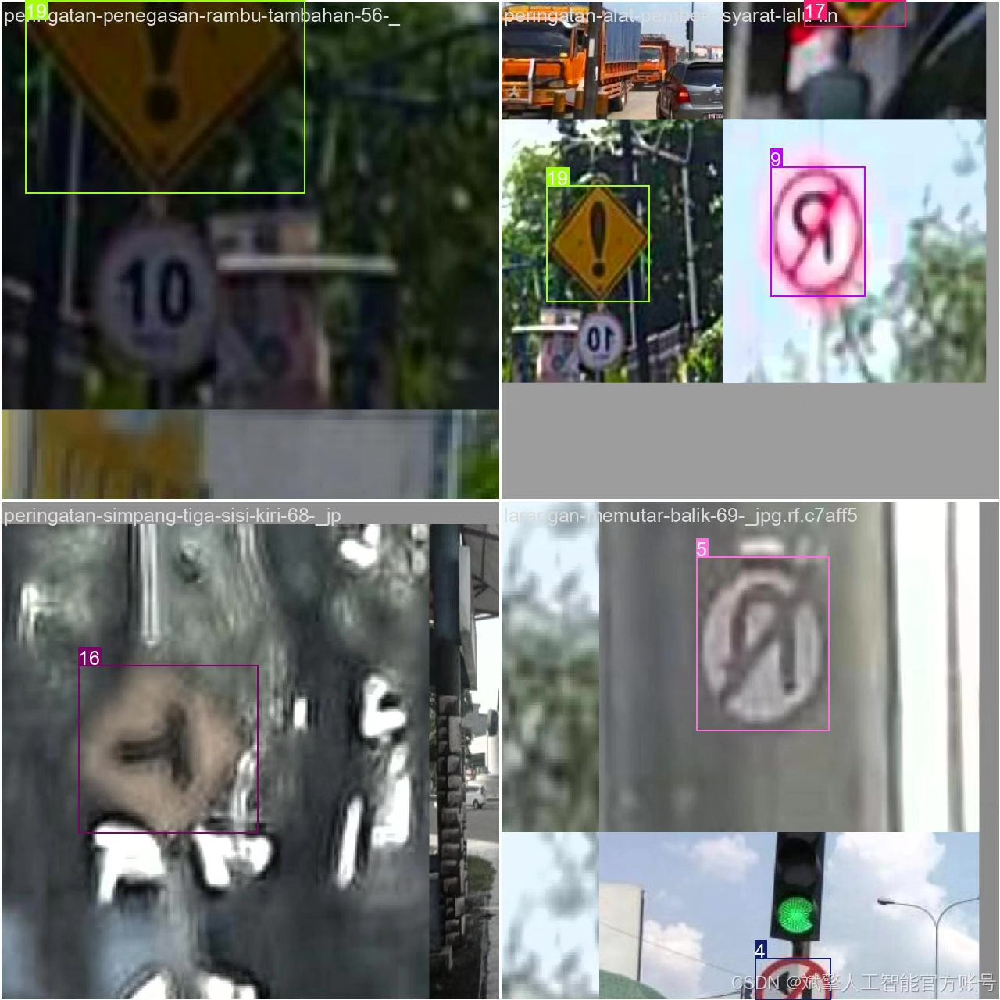
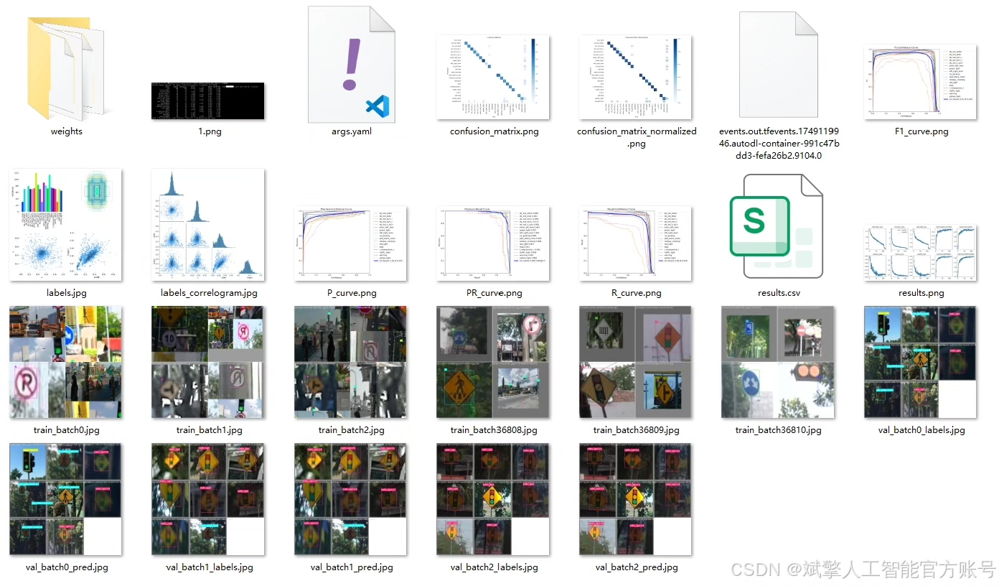
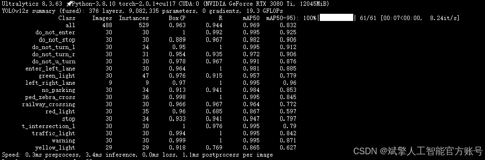
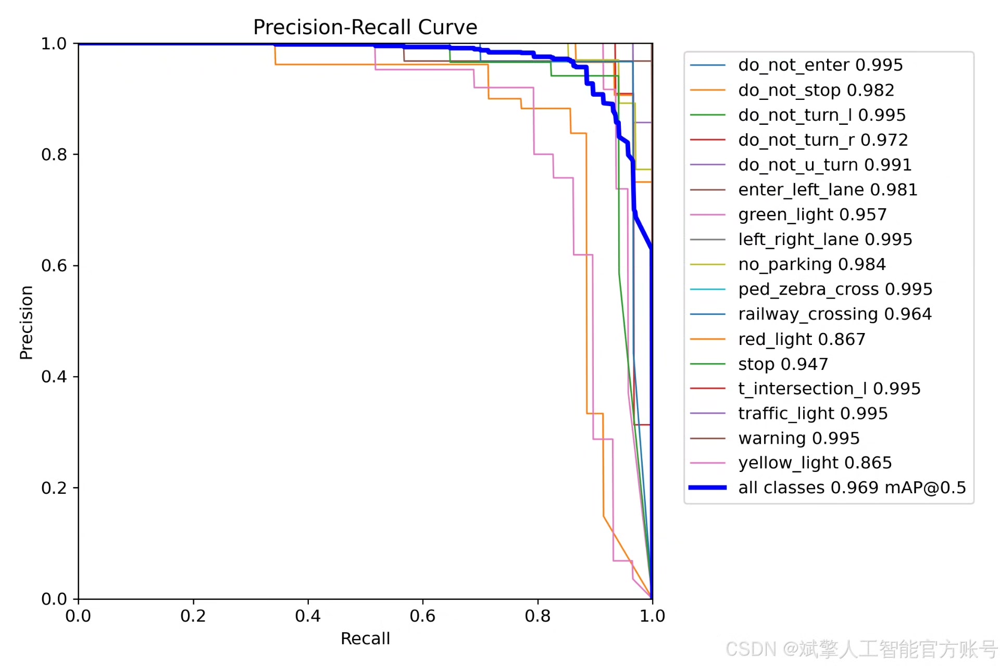
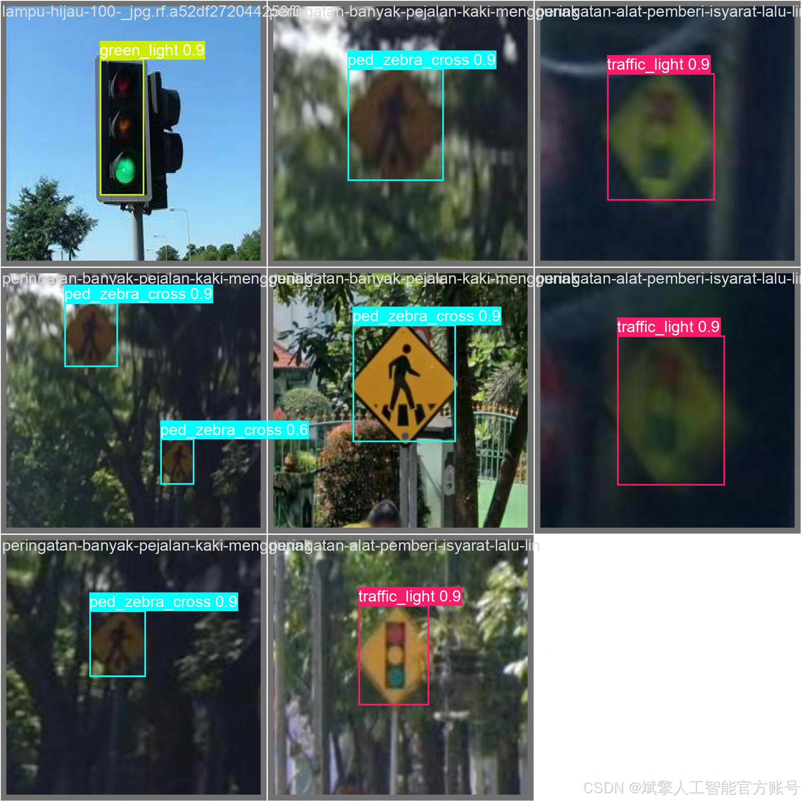
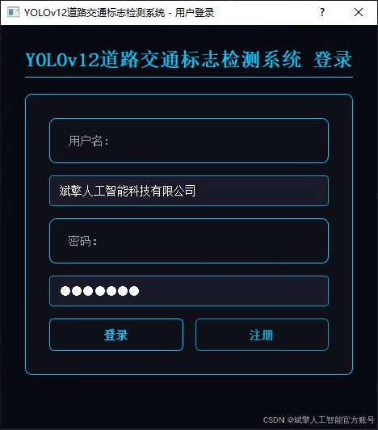

# YOLOv12 Signal Flag Recognition Software Resources

## Body

YOLOv12 Signal Flag Recognition Software Resources Share - Deep Learning YOLOv12-based Road Sign Flag Recognition and Detection System (YOLOv12+YOLO dataset + UI interface + login registration interface + Python project source code + model)

This article is based on the YOLOv12 deep learning framework, designing and implementing a road traffic signal flag detection system. This system can accurately recognize 21 types of traffic signs, including bus stops, prohibited passage, stop for yield, prohibited left turn, prohibited right turn, prohibited turning, left lane, green light, left and right lanes, prohibited parking, parking lot, pedestrian crossing, zebra crossing, railway crossing, red light, stop sign, T-junction left turn, traffic signal light, turning, warning sign, and yellow light. The system uses the YOLO dataset for training, containing 1376 training images, 488 validation images, and 229 test images. Through data enhancement and model optimization, the detection accuracy has been improved. In addition, the system is equipped with a user-friendly UI interface, supporting login registration functions. Experimental results show that this system has high detection accuracy and real-time performance in complex traffic scenarios, providing effective technical support for intelligent traffic management and autonomous driving.

✅ User Login Registration: Supports password verification and security validation.
✅ Three detection modes: Based on the YOLOv12 model, supports image, video, and real-time camera detection, accurately recognizing targets.
✅ Dual-screen comparison: Display original images and detection results on the same screen.
✅ Data visualization: Real-time table displaying the category, confidence, and coordinates of detected targets.
✅ Intelligent parameter adjustment: Offers a confidence slide bar to dynamically optimize detection accuracy, adapting to different scene needs.
✅ Sci-fi style interactive interface: Dark theme combined with dynamic light effects, reducing visual fatigue and improving operational experience.

## Images

## Payment

Here is a pay link on Stripe ( https://buy.stripe.com/3cs8yP7sY87d0vu9AB ). Please contact me lonlonago@foxmail.com after funding $89, and I will send you a complete data files , thank you!

